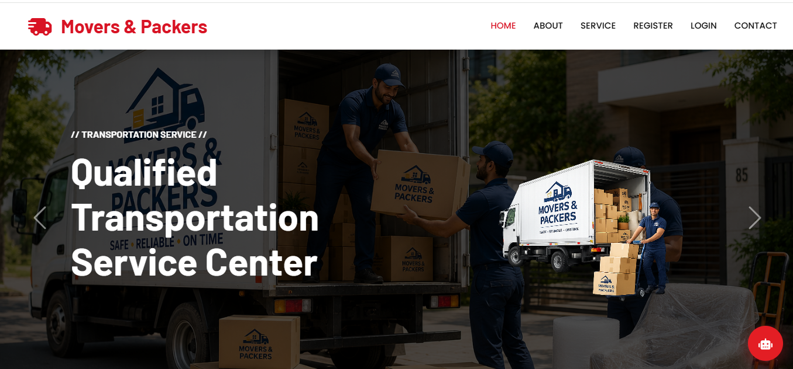
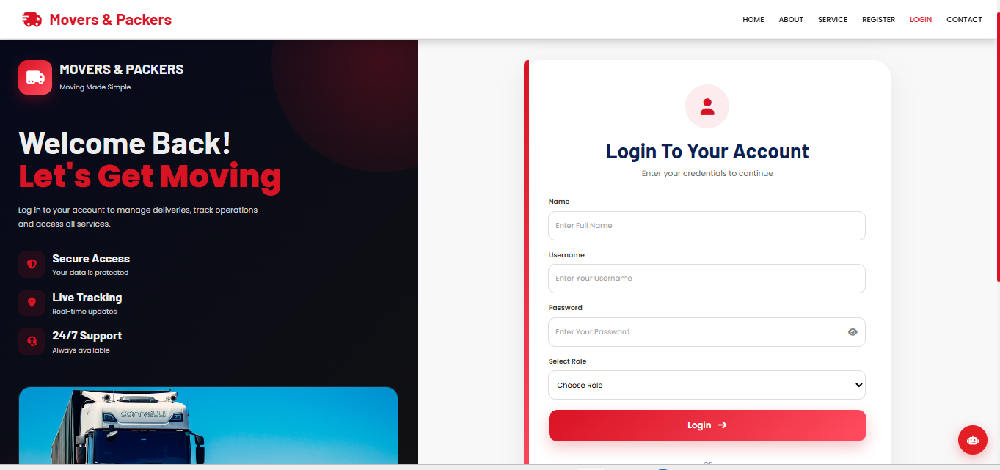
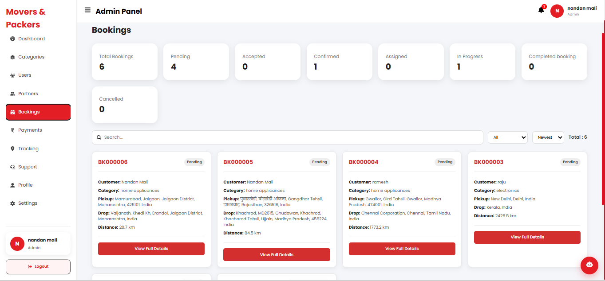
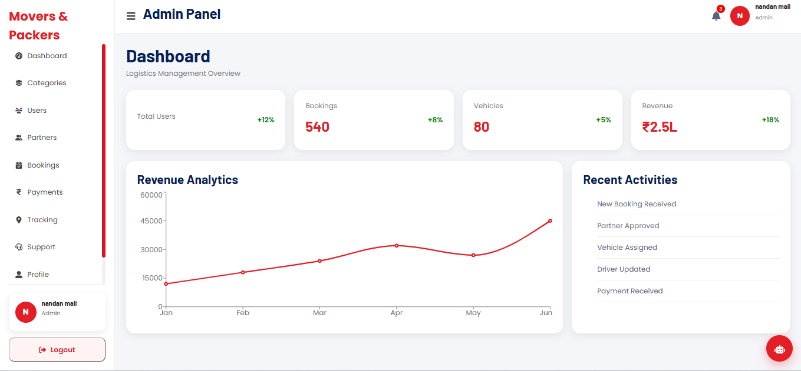
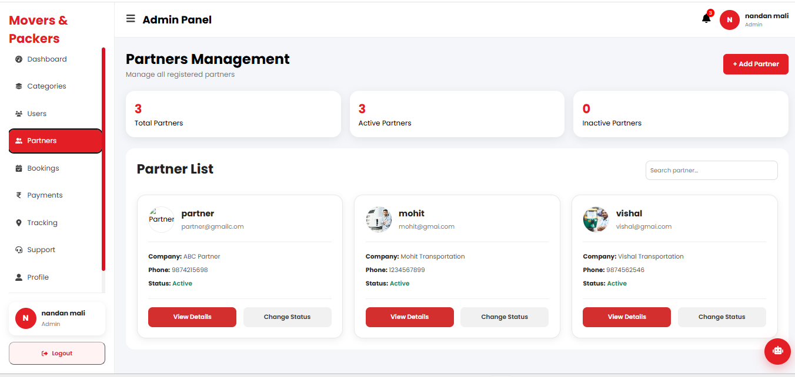

# 🚚 Movers & Packers — Logistics Management Platform

A full-stack web platform designed for moving, relocation, transportation, and logistics service management.

The application provides a structured digital workflow for customers, partners, drivers, vehicle management, bookings, quotations, and administrative operations.

## 🌐 Project Overview

The Movers & Packers platform is designed to simplify the process of requesting and managing moving and transportation services through a centralized web application.

The system combines a responsive React frontend with a Node.js and Express backend, supported by MongoDB for data management.

### Core Architecture

```text
React.js Frontend
        ↓
REST API
        ↓
Node.js + Express.js
        ↓
MongoDB + Mongoose
```

## ✨ Key Features

### 👤 User Management
- User registration and authentication
- Login and account management
- Role-based application access
- User-specific dashboards

### 📦 Booking & Moving Services
- Moving-service booking workflow
- Customer booking information
- Category and subcategory selection
- Pickup and drop-off location selection
- Distance and fare-related functionality
- Booking management

### 💬 Quotation Workflow
- Customer booking requests
- Partner quotation workflow
- Quote management
- Customer quote selection

### 🚛 Vehicle & Driver Management
- Vehicle management
- Driver management
- Partner-side vehicle and driver functionality
- Assignment and operational management

### 🏢 Partner Management
- Partner dashboard
- Business profile management
- Assigned jobs
- Orders and operational information
- Earnings-related functionality

### 🛠️ Admin Management
- Category management
- Subcategory management
- User management
- Vehicle-related management
- Driver-related management
- Administrative dashboards

### 🗺️ Location Features
- Pickup and drop-off location selection
- Map-based functionality
- Location and distance-related processing

### 📱 Responsive Interface
- Responsive layouts
- Dashboard interfaces
- Mobile-friendly components
- Separate interfaces for different user roles

## 🧑‍💻 Technology Stack

### Frontend

- React.js
- JavaScript
- React Router
- Context API
- Axios
- HTML5
- CSS3
- Responsive Web Design

### Backend

- Node.js
- Express.js
- REST APIs
- JavaScript

### Database

- MongoDB
- Mongoose

### Authentication & Security

- JWT-based authentication
- Role-based access
- Environment variables for sensitive configuration

### Development & Deployment

- Git
- GitHub
- Postman
- Vercel
- Render

## 📁 Project Structure

```text
movers-packers-platform/
│
├── Frontend/
│   ├── Layouts/
│   ├── Pages/
│   ├── Panel/
│   ├── Routes/
│   ├── components/
│   ├── config/
│   ├── styles/
│   ├── utils/
│   ├── App.js
│   ├── App.css
│   ├── apiUrl.js
│   └── package.json
│
├── Backend/
│   ├── controller/
│   ├── models/
│   ├── routes/
│   ├── utils/
│   ├── app.js
│   └── package.json
│
├── .gitignore
└── README.md
```

## 🔐 Environment Variables

Sensitive configuration is managed through environment variables and is intentionally excluded from the repository.

Typical configuration may include:

```env
MONGODB_URI=your_mongodb_connection_string
JWT_SECRET=your_jwt_secret
```

Additional environment variables may be required depending on the enabled integrations and deployment configuration.

**Never commit real credentials, API keys, database connection strings, tokens, or webhook secrets to the repository.**

## 🚀 Running the Project Locally

### Clone the repository

```bash
git clone https://github.com/nandanmaliofficial/movers-packers-platform.git

cd movers-packers-platform
```

### Frontend

```bash
cd Frontend
npm install
npm start
```

### Backend

Open another terminal:

```bash
cd Backend
npm install
npm start
```

Make sure the required environment variables are configured before starting the backend.

## 🔄 Application Flow

A simplified application workflow is:

```text
Customer
   ↓
Registration / Login
   ↓
Create Booking
   ↓
Select Service & Locations
   ↓
Booking Request
   ↓
Partners / Service Providers
   ↓
Quotation
   ↓
Customer Selects Quote
   ↓
Service Fulfillment
```

## 🎯 Project Highlights

This project demonstrates practical experience with:

- Full-stack application architecture
- React component-based development
- REST API development
- MongoDB data modeling
- Authentication and authorization
- Role-based application workflows
- Dashboard development
- CRUD operations
- API integration
- Responsive UI development
- Git and GitHub workflow
- Frontend and backend deployment

## 📸 Screenshots

### Homepage



### Loginpage



### Booking Collection



### Dashboard



### Partner Collection



## 🌍 Deployment

The application is designed for separate frontend and backend deployment.

```text
Frontend → Vercel

Backend → Render

Database → MongoDB Atlas
```

Live production links will be added after the project is deployed through the new professional deployment accounts.

## 🔮 Future Improvements

Potential improvements may include:

- Further optimization of the booking workflow
- Additional payment integrations
- Enhanced real-time communication
- Improved analytics and reporting
- Additional logistics integrations
- Further performance and security improvements

## 👨‍💻 Developer

**Nandan Mali**

MERN Stack Developer | Full-Stack Web Developer

Building modern websites and full-stack web applications for businesses and startups.

---

⭐ If you find this project interesting, feel free to explore the repository.
